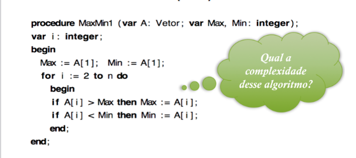
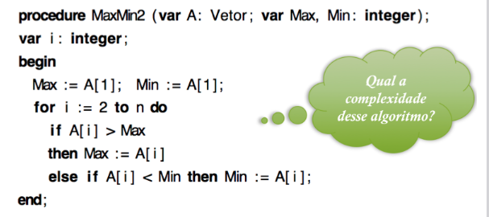
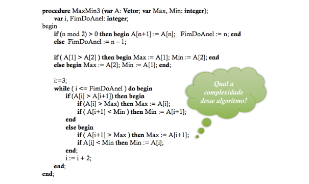
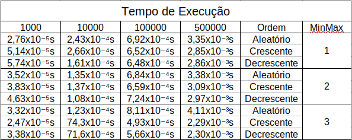

<h1 align='center'>Mínimo e Máximo</h1>

<div align = "center" >

[](https://code.visualstudio.com/docs/?dv=linux64_deb)


</div>

> Status: Finalizado ✅

## Introdução
<p align="justify">
Este programa faz referência a disciplina Algorítmo e Estrutura de Dados I, desenvolvido na linguagem C++ na IDE Visual Studio Code, usando uma makefile disponibilizada pelo docente. O MinMax, nome genérico para explicar a funcionalidade do programa, são algorítmos de leitura de um Vetor para encontrar o valor Mínimo (Min) e o valor Máximo (Max). Esse programa serve como uma base de estudo para o tempo de execução de diferentes implementações que desempenham a mesma função, para que enfim esses tempos sejam analisados.
</p>

## Objetivos

<p align='justify'>
O objetivo deste trabalho é analisar os tempos de execução dos três diferentes algorítmos fornecidos para encontrar o Mínimo e Máximo dentro de um vetor. Com isso, os resultados serão relacionados aos conceitos de análise assintótica, com o intúito último de consolidar os conceitos discutidos dentro de sala, bem como aprofundar o conhecimento geral do conteúdo.
</p>

## Arquivos

## src
- ``` main.cpp ```: Arquivo principal;
- ``` MinMax.hpp ```: Assinatura das funções relacionadas à manipulação dos vetores;
- ``` MinMax.cpp ```: Implementação das funções relacionadas à manipulação dos vetores.

## Funções
- ```MinMax01(const std::vector<int>& meuVetor)```: Essa função implementa o algorítmo para o MinMax 1, executa o algorítmo e calcula o tempo de execução, que é retornado pela função.
- ```MinMax02(const std::vector<int>& meuVetor)```: Essa função implementa o algorítmo para o MinMax 2, executa o algorítmo e calcula o tempo de execução, que é retornado pela função.
- ```MinMax03(const std::vector<int>& meuVetor)```: Essa função implementa o algorítmo para o MinMax 3, executa o algorítmo e calcula o tempo de execução, que é retornado pela função.
- ```Ordenação(std::vector<int>& MeuVetor, int definicao)```: Como o nome diz, a função Ordenação ordena, de acordo com o valor da definição (que é puramente explicitado pelo programador), se o vetor será organizado de forma crescente ou decrescente, e então retorna o vetor ordenado..
- ```Preencher_Vetor()```: Essa função usa a função rand() da biblioteca padrão de C para gerar números aleatórios entre 0 e 1000, e preenche cada posição do vetor com um desses valores, então retorna o vetor desordenado e preenchido.
- ```ExecutarMinMax01(std::vector<int>& MeuVetor, int NumerodeExecuções)```: Essa função executa o algorítmo MinMax01 para o vetor recebido. Essa execução acontece para o vetor desordenado, ordenado crescente e ordenado decrescente. A variável número de execuções define quantas vezes o algororítmo será executado. Para cada variação, a função printa o valor de média encontrado no terminal.
- ```ExecutarMinMax02(std::vector<int>& MeuVetor, int NumerodeExecuções)```: Essa função executa o algorítmo MinMax02 para o vetor recebido. Essa execução acontece para o vetor desordenado, ordenado crescente e ordenado decrescente. A variável número de execuções define quantas vezes o algororítmo será executado. Para cada variação, a função printa o valor de média encontrado no terminal.
- ```ExecutarMinMax03(std::vector<int>& MeuVetor, int NumerodeExecuções)```: Essa função executa o algorítmo MinMax03 para o vetor recebido. Essa execução acontece para o vetor desordenado, ordenado crescente e ordenado decrescente. A variável número de execuções define quantas vezes o algororítmo será executado. Para cada variação, a função printa o valor de média encontrado no terminal.
-  ```ExecutarGeral(std::vector<int> VetorXposicoes, int NumerodeExecuções)```: Essa função encapsula as três citadas anterioremente, no intuito de executar os 3 algorítmos diferentes em apenas "uma" chamada, facilitando os testes. Dentro dela as funções de Execução de cada MinMax são chamadas. 

## Resolução do Problema
<p aligh='justify'>
Para a resolução do problema, primeiro foi necessário fazer os algorítmos de Mínimo e Máximo, que foram fornecidos pelo professor e traduzidos do Pascal para C++.

 <p align="center"></p>
 <p align="center"> Algorítmo do MinMax01 em Pascal. </p>
Esse algorítmo é, na teoria, o mais custoso em termos de energia e tempo. O algorítmo Mínimo e Máximo 01 define as variáveis Min e Max como a posição 0 do vetor, então percorre o mesmo dentro de um loop. Neste loop o programa confere dois ifs para se o valor da posição atual é menor ou maior que o Min e o Max, e dependendo desse resultado atribui um novo valor a uma das duas variáveis citadas anteriormente.
 
 <p align="center"></p>
 <p align="center"> Algorítmo do MinMax02 em Pascal. </p>
O algorítmo MinMax02 é o caso médio dos três algorítmos analisados. Semelhante ao primeiro caso, esse algorítmo define as variáveis Min e Max como a primeira posição do vetor, então percorre o vetor por meio de um loop à partir da 2° posição. Dentro do loop, são executados um if e um else if. Dessa forma, se o primeiro if for validado, o segundo não será executado. Essa pequena mudança já diminui os custos de energia e tempo para a execução do programa.
 
 <p align="center"></p>
 <p align="center"> Algorítmo do MinMax03 em Pascal. </p>
Esse algorítmo é, na teoria, o menos custoso em termos de energia e tempo. O algorítmo começa conferindo por meio de um if o tamanho do vetor. Se o vetor por par, então nada é feito. Caso seja ímpar, será acrescida uma posição ao vetor. Após isso, o programa confere as duas primeiras posições do vetor e por meio de uma sequência de if e else, atribui esses valores a uma variável Min e outra Max. Entrando no loop, o programa executa uma sequência em cascata de 2 ifs. Caso esses ifs não sejam validados, o programa executa o else, que é também formado por 2 ifs. Por fim o programa incremente 2 posições e recomeça o loop até ter conferido todas as posições do vetor.
 
</p>

<p align='justify'> 
Após traduzir os códigos para C++, as funções para manipulação dos vetores foram criadas. Segundo especificações do exercício, os vetores deveriam ser preenchidos com valores randômicos. Para isso a função Preencher_Vetor é criada. Ela usa a função rand() da biblioteca padrão de C para criar os valores e então preencher cada posição com um deles. A fim de evitar problemas já conhecidos dessa função, a linha de código 113, " srand(time(nullptr)); " serve para tentar tornar essa geração o mais randômica e espalhada possível. Com essa função pronta, todas as variações de vetores são preenchidas.
</p>

<p align='justify'> 
 Um outro problema a ser resolvido é a execução dos vetores para os três algorítmos. Para a resolução desse problema as funções de execução foram criadas. Essas funções recebem o vetor e alteram ele dentro da própria função, mas ao sair dela o vetor é o mesmo. Com isso é possível "reciclar" o mesmo vetor para o uso dentro dos outros algorítmos de MinMax. Além disso, a fim de facilitar o cálculo da média, essas funções tambem recebem o número de execuções, fornecido pelo usuário, e indica quantas vezes o mesmo algorítmo será executado e fornecerá a média dessas execuções. Explicitando um pouco mais essa resolução, temos as funções de MinMax01, 02 e 03. É dentro delas que a função clock() da biblioteca time.h são usadas para calcular o tempo de execução dos programas, calculado na maioria dos casos em milisegundos.
</p>

## Resultados

<p align="center"></p>
<p align="center"> Tabela de resultados dos algorítmos. </p>

## Conclusão
<p align="justify">
O exercício induz a boas práticas de programação e auxilia o programador na lógica de funcionamento de uma matriz no ambiente da máquina. Além disso, embora a lógica no exercício pareça bem simplória, quando uma matriz muito grande é usada, diferentes problemas podem ser avaliados, tais como o tempo de execução muito longo, problemas na leitura do arquivo e, também, na estruturação do programa. Uma sequência muito longa de if's como foi feita no método ProximaGeração, por exemplo, é muito custosa para a máquina e torna o tempo de execução muito longo, além de fornecer margem para que o programador acabe cometendo erros em cascata, que no fim podem arruinar completamente a execução do programa.. Portanto, esse exercício é uma boa forma de treinar diferentes aspectos que envolvem a programação, induzindo à boas práticas e, também, a um pensamento mais estruturado sobre como o programa será feito.
</p>

## Referências
O arquivo makefile usado foi retirado de um dos projetos do professor Michel Pires, segue o link para o seu github:
<p>
DA SILVA, Michel Pires. Página Principal GitHub. <a> https://github.com/mpiress </a>. Acesso em 16 de Março de 2024.
</p>

## Compilação e Execução

 Especificações da máquina em que o código foi rodado:
  * Processador Intel Core i5, 10th Gen;
  * Sistema Operacional Windows 11 Home;
  * Terminal do WSL: Ubuntu 22.04.5;
  * 16GB de RAM.
* | Comando                |  Função                                                                                           |                     
  | -----------------------| ------------------------------------------------------------------------------------------------- |
  |  `make clean`          | Apaga a última compilação realizada contida na pasta build                                        |
  |  `make`                | Executa a compilação do programa utilizando o g++, e o resultado vai para a pasta build           |
  |  `make run`            | Executa o programa da pasta build após a realização da compilação                                 |

  ## Contato
<p align='justify'> Jader Oliveira Silva </p>
✉️ <i>jaderoliveira28@gmail.com</i>

  
