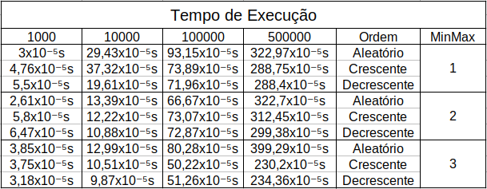

<h1 align='center'>Mínimo e Máximo</h1>

<div align = "center" >

[](https://code.visualstudio.com/docs/?dv=linux64_deb)


</div>

> Status: Finalizado ✅

## Introdução
<p align="justify">
Este programa faz referência a disciplina Algorítmo e Estrutura de Dados I, desenvolvido na linguagem C++ na IDE Visual Studio Code, usando uma makefile disponibilizada pelo docente. O MinMax, nome genérico para explicar a funcionalidade do programa, são algorítmos de leitura de um Vetor para encontrar o valor Mínimo (Min) e o valor Máximo (Max). Esse programa serve como uma base de estudo para o tempo de execução de diferentes implementações que desempenham a mesma função, para que enfim esses tempos sejam analisados.
</p>

## Objetivos

<p align='justify'>
O objetivo deste trabalho é analisar os tempos de execução dos três diferentes algorítmos fornecidos para encontrar o Mínimo e Máximo dentro de um vetor. Com isso, os resultados serão relacionados aos conceitos de análise assintótica, com o intúito último de consolidar os conceitos discutidos dentro de sala, bem como aprofundar o conhecimento geral do conteúdo. Para tanto, diferentes implementações serão feitas e, além disso, outras ferramentas como o gnuplot serão utilizados.
</p>

## Arquivos

## src
- ``` main.cpp ```: Arquivo principal;
- ``` MinMax.hpp ```: Assinatura das funções relacionadas à manipulação dos vetores;
- ``` MinMax.cpp ```: Implementação das funções relacionadas à manipulação dos vetores.

## datasets
- ``` Dados.txt ```: Esse arquivo de texto guarda informações referentes ao tamanho do vetores e os dados para cada MinMax (algorítmos) utilizados. É por meio deste arquivo de texto que o gráfico mais complexo é plotado.;
- ``` Dados1.txt ```: Esse arquivo de texto guarda informações referentes ao tamanho dos vetores e os dados do MinMax01 utilizados. É por meio deste arquivo de texto que o gráfico deste algorítmo é plotado;
- ``` Dados2.txt ```: Esse arquivo de texto guarda informações referentes ao tamanho dos vetores e os dados do MinMax02 utilizados. É por meio deste arquivo de texto que o gráfico deste algorítmo é plotado;
- ``` Dados3.txt ```: Esse arquivo de texto guarda informações referentes ao tamanho dos vetores e os dados do MinMax03 utilizados. É por meio deste arquivo de texto que o gráfico deste algorítmo é plotado;
- ``` Execução.gp ```: Esse arquivo '.gp' é o responsável por utilizar o arquivo de texto 'Dados.txt' para plotar o gráfico mais complexo.;
- ``` ExecuçãoMinMax01.gp ```: Esse arquivo '.gp' é o responsável por utilizar o arquivo de texto 'Dados1.txt' para plotar o gráfico relacionado ao algorítmo de Mínimo e Máximo 01 via terminal.;
- ``` ExecuçãoMinMax02.gp ```: Esse arquivo '.gp' é o responsável por utilizar o arquivo de texto 'Dados2.txt' para plotar o gráfico relacionado ao algorítmo de Mínimo e Máximo 02 via terminal.;
- ``` ExecuçãoMinMax03.gp ```: Esse arquivo '.gp' é o responsável por utilizar o arquivo de texto 'Dados3.txt' para plotar o gráfico relacionado ao algorítmo de Mínimo e Máximo 03 via terminal.;


## Funções
- ```MinMax01(const std::vector<int>& meuVetor)```: Essa função implementa o algorítmo para o MinMax 1, executa o algorítmo e calcula o tempo de execução, que é retornado pela função.
- ```MinMax02(const std::vector<int>& meuVetor)```: Essa função implementa o algorítmo para o MinMax 2, executa o algorítmo e calcula o tempo de execução, que é retornado pela função.
- ```MinMax03(const std::vector<int>& meuVetor)```: Essa função implementa o algorítmo para o MinMax 3, executa o algorítmo e calcula o tempo de execução, que é retornado pela função.
- ```Ordenação(std::vector<int>& MeuVetor, int definicao)```: Como o nome diz, a função Ordenação ordena, de acordo com o valor da definição (que é puramente explicitado pelo programador), se o vetor será organizado de forma crescente ou decrescente, e então retorna o vetor ordenado..
- ```Preencher_Vetor()```: Essa função usa a função rand() da biblioteca padrão de C para gerar números aleatórios entre 0 e 1000, e preenche cada posição do vetor com um desses valores, então retorna o vetor desordenado e preenchido.
- ```ExecutarMinMax01(std::vector<int>& MeuVetor, int NumerodeExecuções)```: Essa função executa o algorítmo MinMax01 para o vetor recebido. Essa execução acontece para o vetor desordenado, ordenado crescente e ordenado decrescente. A variável número de execuções define quantas vezes o algororítmo será executado. Para cada variação, a função printa o valor de média encontrado no terminal.
- ```ExecutarMinMax02(std::vector<int>& MeuVetor, int NumerodeExecuções)```: Essa função executa o algorítmo MinMax02 para o vetor recebido. Essa execução acontece para o vetor desordenado, ordenado crescente e ordenado decrescente. A variável número de execuções define quantas vezes o algororítmo será executado. Para cada variação, a função printa o valor de média encontrado no terminal.
- ```ExecutarMinMax03(std::vector<int>& MeuVetor, int NumerodeExecuções)```: Essa função executa o algorítmo MinMax03 para o vetor recebido. Essa execução acontece para o vetor desordenado, ordenado crescente e ordenado decrescente. A variável número de execuções define quantas vezes o algororítmo será executado. Para cada variação, a função printa o valor de média encontrado no terminal.
-  ```ExecutarGeral(std::vector<int> VetorXposicoes, int NumerodeExecuções)```: Essa função encapsula as três citadas anterioremente, no intuito de executar os 3 algorítmos diferentes em apenas "uma" chamada, facilitando os testes. Dentro dela as funções de Execução de cada MinMax são chamadas. 

## Resolução do Problema
<p aligh='justify'>
Para a resolução do problema, primeiro foi necessário fazer os algorítmos de Mínimo e Máximo, que foram fornecidos pelo professor e traduzidos do Pascal para C++.

 <p align="center"></p>
 <p align="center"> Algorítmo do MinMax01 em Pascal. </p>
Esse algorítmo é, na teoria, o mais custoso em termos de energia e tempo. O algorítmo Mínimo e Máximo 01 define as variáveis Min e Max como a posição 0 do vetor, então percorre o mesmo dentro de um loop. Neste loop o programa confere dois ifs para se o valor da posição atual é menor ou maior que o Min e o Max, e dependendo desse resultado atribui um novo valor a uma das duas variáveis citadas anteriormente.
 
 <p align="center"></p>
 <p align="center"> Algorítmo do MinMax02 em Pascal. </p>
O algorítmo MinMax02 é o caso médio dos três algorítmos analisados. Semelhante ao primeiro caso, esse algorítmo define as variáveis Min e Max como a primeira posição do vetor, então percorre o vetor por meio de um loop à partir da 2° posição. Dentro do loop, são executados um if e um else if. Dessa forma, se o primeiro if for validado, o segundo não será executado. Essa pequena mudança já diminui os custos de energia e tempo para a execução do programa.
 
 <p align="center"></p>
 <p align="center"> Algorítmo do MinMax03 em Pascal. </p>
Esse algorítmo é, na teoria, o menos custoso em termos de energia e tempo. O algorítmo começa conferindo por meio de um if o tamanho do vetor. Se o vetor por par, então nada é feito. Caso seja ímpar, será acrescida uma posição ao vetor. Após isso, o programa confere as duas primeiras posições do vetor e por meio de uma sequência de if e else, atribui esses valores a uma variável Min e outra Max. Entrando no loop, o programa executa uma sequência em cascata de 2 ifs. Caso esses ifs não sejam validados, o programa executa o else, que é também formado por 2 ifs. Por fim o programa incremente 2 posições e recomeça o loop até ter conferido todas as posições do vetor.
 
</p>

<p align='justify'> 
Após traduzir os códigos para C++, as funções para manipulação dos vetores foram criadas. Segundo especificações do exercício, os vetores deveriam ser preenchidos com valores randômicos. Para isso a função Preencher_Vetor é criada. Ela usa a função rand() da biblioteca padrão de C para criar os valores e então preencher cada posição com um deles. A fim de evitar problemas já conhecidos dessa função, a linha de código 113, " srand(time(nullptr)); " serve para tentar tornar essa geração o mais randômica e espalhada possível. Com essa função pronta, todas as variações de vetores são preenchidas.
</p>

<p align='justify'> 
 Um outro problema a ser resolvido é a execução dos vetores para os três algorítmos. Para a resolução desse problema as funções de execução foram criadas. Essas funções recebem o vetor e alteram ele dentro da própria função, mas ao sair dela o vetor é o mesmo. Com isso é possível "reciclar" o mesmo vetor para o uso dentro dos outros algorítmos de MinMax. Além disso, a fim de facilitar o cálculo da média, essas funções tambem recebem o número de execuções, fornecido pelo usuário, e indica quantas vezes o mesmo algorítmo será executado e fornecerá a média dessas execuções. Explicitando um pouco mais essa resolução, temos as funções de MinMax01, 02 e 03. É dentro delas que a função clock() da biblioteca time.h são usadas para calcular o tempo de execução dos programas, calculado na maioria dos casos em milisegundos.
</p>

## Resultados

<p aligh='justify'>

Antes de falar sobre os resultados propriamente, seguem-se duas tabelas que irão guiar a discurssão desses resultados.

<p align="center"></p>
<p align="center"> Tabela de com os valores matemáticos dos algorítmos. </p>

<p align="center"></p>
<p align="center"> Tabela de resultados dos algorítmos. </p>

Falando sobre a primeira imagem, basta trocar o valor de n por um número inteiro que é possível ver que, matemáticamente, os algorítmos seguem o melhor caso, caso médio e pior caso. Isso, claro, representa a teoria, feita segundo análise assintática e portanto tem uma base de veracidade. Saindo dessa teoria, tem-se os resultados da tabela, que são resultados de uma média de 10 execuções para cada vetor, nas três ordens explicitadas, para cada algorítmo.

Como esperado, o tempo de execução aumenta com o aumento do tamanho do vetor, e a diferença de tempo de execução entre os variados tamanhos é notável. Além disso, é possível notar que, embora o MinMax 01 deveria ser o pior, existem alguns casos em que ele desempenha melhor que um dos algorítmos, isso também acontece com o MinMax02. À título de exemplo, a execução aleatória do vetor de tamanho 1000 para o MinMax02 é o melhor resultado. No entanto, como já é esperado, o MinMax03 perfoma melhor na maioria dos casos crescentes e decrescentes, como mostrado na tabela. Algo que também é necessário ser dito é que o MinMax03 pode performar pior que os demais, como é o caso do volume de dados aleatórios para o maior dos vetores, o de 500000 posições, em que fica evidente um resultado inferior aos demais algorítmos.

Por fim, é necessário discutir porque isso acontece. Como explicado na construção de cada código, as implementações entre cada MinMax diferem uma das outras. O MinMax 01 percorrerá e executará todos os ifs, o que normalmente aumentará o tempo de execucação e os custos do geral. É também por isso que os tempos crescentes e decrescentes possuem valores próximos. O MinMax 02 também percorrerá todo o vetor, posição por posição, mas ja apresenta uma maneira mais eficaz de código, onde o duplo if é trocado por um if else, que permite uma execução mais rápida e eficaz. Por último, têm-se o MinMax 03, que percorre o vetor de duas em duas posições, essencialmente analisando o vetor duas vezes mais rápido. ALém disso, ele também implementa uma sequência if else muito inteligente que permite, de forma semelhante ao algorítmo de MinMax 02, uma execução mais rápida e eficaz. Enfim, é necessário dizer que existem processos dentro da própria máquina que podem e influenciar esses resultados, e isso foge ao controle dos testes aqui explicitados. Tais processos podem variar em grau e complexidade e podem, também, ter uma prioridade de execução, essencialmente influenciando os testes realizados.

Uma forma de remediar isso é aumentar o número de execuções. Na tabela aqui exposta a média de execuções foi 10, em um teste ideal esse número seria bem superior, mas o tempo de execução do programa também aumentaria, embora os valores ficariam bem mais fidedignos à realidade. Note que por tempo de execução quer-se dizer que o computador levará mais tempo para executar o programa e realizar todas as operações explicitadas no código, porém este processo permitirá que as médias estejam o mais próximas de uma realidade ideal.

## Gráficos

Abaixo temos os gráficos indivíduais para cada algorítmo utilizado neste repositório. Os gráficos foram feitos por meio do GnuPlot, um programa que é bem conhecido e existe há mais de uma década. Essa ferramenta permite fazer a plotagem de gráficos em duas ou três dimensões, e seu uso aqui foi exatamente este. Ele pode ser instalado facilmente na maioria das máquinas e é gratuito.

<p align="center"></p>
<p align="center"> Gráfico de resultados do Algorítmo de Mínimo e Máximo 01. </p>

Por meio da análise individual deste gráfico, fica bem evidente que o algorítmo mais básico de Mínimo e Máximo utilizado aqui performa pior em casos aleatórios, enquanto tende a seguir um padrão comum entre dados ordenados de modo crescente ou decrescente.

<p align="center"></p>
<p align="center"> Gráfico de resultados do Algorítmo de Mínimo e Máximo 02. </p>

Este gráfico, que faz referência ao algorítmo de Mínimo e Máximo 02, deixa evidente uma caractéristica um pouco mais implícita nesse código. A sequência de if else utilizada para este algorítmo avalia, primeiro, o maior número. Em um vetor ordenado de maneira crescente, esse if será sempre utilizado, enquanto sua sequência else nunca é analisada, já que não há pouca ou quase nenhuma chance de que isso aconteça. Em um vetor com repetições, no entanto, o programa poderá entrar no comando else, no entanto nada será executado.

<p align="center"></p>
<p align="center"> Gráfico de resultados do Algorítmo de Mínimo e Máximo 03. </p>

Este gráfico faz referência ao algorítmo de Mínimo e Máximo 03. Assim como foi possível notar uma caractérista específica nos gráficos anteriores, este também traz a luz o problema deste algorítmo: Aleatoriaedade dos dados. Embora o programa ainda execute em um tempo bem pequeno ( estamos falando aqui de coisas multiplicadas por 10⁻⁵ ), em massas de dados bem maiores que 500000, que facilmente acontece em problemas reais, esse valor cresce exponencialmente, de forma que, em algum momento, caso não se saiba a forma como os dados entrarão para análise, esse algorítmo pode acabar por ser ineficiente.

<p align="center"></p>
<p align="center"> Gráfico de resultados Gerais para todos os Algorítmos. </p>

Por fim, este gráfico é uma síntese dos outros citados e discutidos anteriormente. Com essa síntese torna-se mais fácil analisar os algorítmos análisados e demonstra, enfim, a conclusão deste projeto. Vale notar que o MinMax03, ao mesmo tempo em que foi o melhor quando ordenado, foi também o pior quando exposta à massa de dados aleatória.

</p>

## Conclusão
<p align="justify">
O estudo de diferentes algorítmos MinMax demonstra como a implementação inteligente de diferentes funções que desempenham o mesmo papel podem apresentar comportamentos diferentes quando analisadas. Isso fica explicito com à vista da tabela feita, que permite uma análise mais precisa dos resultados. O MinMax03, embora tido antes como sempre o melhor caso, pode desempenhar pior que os demais algorítmos quando as condições não fossem as mais apropriadas para o seu funcionamento. Isso também é verdade para o MinMax01, que embora tido como o pior caso, há situações em que ele performará melhor que os outros algorítmos.

É notável que a análise assintótica também desempenha um importante papel no entendimento geral desse projeto, já que é esse conhecimento que prevê o comportamento dos algorítmos, que na maioria das vezes segue o que é explicito na tabela. Além isso, o programa nos permite um olhar mais profundo sobre os fatores externos que influenciam a execução do programa, e isso fica bem explicito na tabela de MinMax01, onde as execuções deveriam seguir uma certa linearidade, mas apresentam grandes diferenças.

Por fim, esse projeto permitiu o aprofundamento prático dos temas discutidos em sala, principalmente sobre o tratamento de grandes massas de dados, uma análise que fica clara quando há vista dos resultados obtidos na execução do programa, além de permitir uma ideia mais clara sobre dados ainda maiores do que foram analisados, e o comportamento que eles poderiam apresentar.

</p>

## Referências
O arquivo makefile usado foi retirado de um dos projetos do professor Michel Pires, segue o link para o seu github:
<p>
 
DA SILVA, Michel Pires. Página Principal GitHub. <a> https://github.com/mpiress </a>. Acesso em 04 de Abril de 2024.
</p>

## Compilação e Execução

 Especificações da máquina em que o código foi rodado:
  * Processador Intel Core i5, 10th Gen;
  * Sistema Operacional Windows 11 Home;
  * Terminal do WSL: Ubuntu 22.04.5;
  * 16GB de RAM.
* | Comando                |  Função                                                                                           |                     
  | -----------------------| ------------------------------------------------------------------------------------------------- |
  |  `make clean`          | Apaga a última compilação realizada contida na pasta build.                                       |
  |  `make`                | Executa a compilação do programa utilizando o g++, e o resultado vai para a pasta build.          |
  |  `make run`            | Executa o programa da pasta build após a realização da compilação.                                |
  |  `gnuplot 'nome'`      | Executa o arquivo '.gp' e gera o gráfico via gnuplot.                                             |

  ## Contato
<p align='justify'> Jader Oliveira Silva </p>
✉️ <i>jaderoliveira28@gmail.com</i>

  
